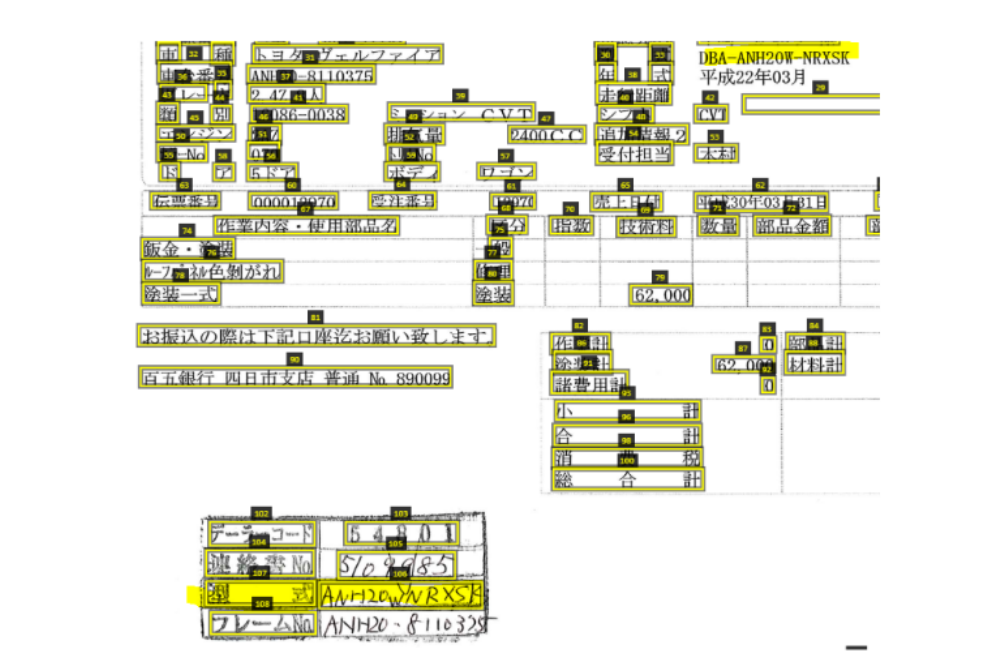

A template to build a deep-learning model with tensorflow

# transformer_gkv

    <h1>Feature design for graph based key-value recognition</h1>
 

---
    
|Executor | Brown
|:-------|:-----
|Project | 
|Nature | Experiment
|Goal|Feature design for graph based key-value recognition

#### 1. [Input](#input)
#### 2. [Distilation](#distilation)
#### 3. [Experiment](#experiment)
#### 4. [Articulation](#articulation)  
####  [Q&A](#qna)  
---
## <a id="input">1. Input</a>
### **1.1 Key Input**
 * Felipe Petroski Such, Shagan Sah, Miguel Dominguez, Suhas Pillai, Chao Zhang, Andrew Michael, Nathan Cahill, Raymond Ptucha : Robust Spatial Filtering With Graph Convolutional Neural Networks
 * Xiang Zhang, Junbo Zhao, Yann LeCun : Character-level Convolutional Networks for Text Classification
 * A. Vaswani, N. Shazeer, N. Parmar, J. Uszkoreit, L. Jones, A. N. Gomez,L. Kaiser, and I. Polosukhin, “Attention Is All You Need,” no. Nips, 2017.
 * Xiaolong Wang, Ross Girshick, Abhinav Gupta, Kaiming He: Non-local Neural Networks. 
 * Double Attention Networks
 * BERT: Pre-training of Deep Bidirectional Transformers for Language Understanding.
 * LinkNet: Relational Embedding for Scene Graph.
 * Graph Convolution for Multimodal Information Extraction from Visually Rich Documents. 

### **1.2 Δ Input**   
* [1] Provide an end-to-end graph-cnn model to get spatial information into classification. It has yielded potential results by its capability to encode both spatial features and node level
information
* [2] Suggest a basic method to improve input feature by adding an character-level embedding layer. Character-level Convolutional Networks has competitive results in comparison with traditional models such as bag of words, n-grams and their TFIDF variants, and deep learningmodels such as word-based ConvNets and recurrent neural networks
* [3] Improve the feature with a flexible encoder-decoder architecture (Transformer) that can learn automatically features on both format and distinguish words with different meaning but
same number of characters. It hopes to catch errors in the layout analysis modules.
* [4] Provide a block to capture long-range dependencies by use f(x,y) function to calculate pair wise (dot product for word-vector, Gaussian Embedded for position), then g(x) to activate important feature. Non-local block is generalization of self-attention mechanism  images in pixel-level 
* [5] CNN is inefficient modeling long-range dependencies, in Graph-CNN many key-value pair is far each other must pass through a stack of layers before affecting the location that lead to optimization difficulties. The non-local net is a new approach but it just gather information and not process carefully. Double Attention Networks firstly highlight global information then distribute to every location.
* [6] Provide a new pretrained language representation model. This paper dissected Tranformer and use mask to hide information to train bidirectional Transformer.
* [7] Non-local net and Transformer consider pixel, word as primitive elements, in the Linknet that is object-level. It has relation with our problem when result of OCR and linecut is considered as node feature. Inspired by attention mechanism , this model build a relational embedding module enables the model to represent connections among all related object and provide global context encoding module, is trained for multi-label object classification, to get contextual information.

---
## <a id="distilation">2. Distilation</a>
### **2.1 Technical Challenge**  
* Training data is not enough to train word2vec in each node feature so vectorizing word bring bad performance. 
* Error from OCR and the line segmentation could reduce the performance significantly
* Target field is merged and splitted. As shown in figure 1, the line pair (35, 36) and (55, 58) are not segmented uniformly  in  the  normal  spatial  distance  mean. Again,  it  is  emphasized  that these type of potentially incorrect line cut in term of node labeling is impossible without any type of OCR feature or semantic understanding.  It is then necessary that the graph key value module have to be modified for the sake of more robust input and output

|  | 
|:--:| 
| *Figure 1: Errors in Line Cut Labeling* |
### **2.2 Solutioning** 

* We proposed two soltion for this dilemma that mainly depend on making a feature design for graph based key-value recognition. We build a model in character-level to get more information in character. 
1. Solution 1: Offer empirical exploration the use of character-level convolutional network.The proposed method contain two step: 
    * Encode vertex feature : We designed ConvNets with 3 block character convolutional layers. Use filters with size [3, 5, 7], [200, 300, 300], [300, 400, 400] respond with kernel_sizes : [4, 3, 3], [5, 3, 3], [6, 3, 3] and pool_sizes : [2, 2, 2], [2, 2, 2], [2, 2, 2]
    * Use graph convolutional neural network to classify include : 
        * 6 edge feature (l-r, r-l, p-c, c-p, u-d,d-u)
		* 1 Embedding layer in character level
		* 1 (96 filters) embedding layer
		* 5 (64 filters) and 2(96 filters) graph-cnn layers of  with Relu, dropout 0.5

|  | 
|:--:| 
| *Figure 2: Character-level convolutional network* |

2. Solution 2: Use Transformer design to encode-decode vertext feature.
    

### **2.3 ΔDistillation**

---
## <a id="experiment">3. Experiment </a>
### **3.1 Experiment Goal** 

### **3.2 Experiment Plan** 
* Get the result of Transformer model
* Combine Transformer with Graph-CNN
* Packaging code

### **3.3 Experiment Result**

### **3.4 Δ Experiment**
**Solution 1** The solution helps model can learn more detail in vertex , so we can remove all  hand-crafted feature but keep good accuracy.

---
## <a id="articulation">4. Articulation</a>
### **4.1 Abstract**
Graph-CNNs operate directly in the spatial domain to generate semantically rich features.
It is breakthroughs architecture and works on both homogeneous and heterogeneous data, learning properties from both graph vertices and edges.
Majority of classification problems, for example in the pharmaceutical, homeland security, and financial domains are unstructured
In specified unstructured data problem , there is a lack of data. Especially, the data for each vertex is not exactly and need to learn more. 
Specifically, our mission is to classify key-value in a document with the data from previous linecut and ocr result. All that information is embeded in a simple vector using bag of word as a vertex of graph.
So performance of graph key-value module is prone to error when layout analysis module fail and we realize that it is necessary to have a more complex vertex feature encoding.
In our work, we will dissect Transformer model[6] to encode the input and decode the output, that make graphKV deeper and catch error from previous step. 
We performed experience in some labeled dataset: daiichi, CMJ, Toyota, FFG, MYL and show that it properly raises the perfomance of our work.

### **4.2 Related works**

### **4.3 Key pictures**

### **4.4 Visual output**

### **4.5 Discussion**  

### **4.6 References**

 * Felipe Petroski Such, Shagan Sah, Miguel Dominguez, Suhas Pillai, Chao Zhang, Andrew Michael, Nathan Cahill, Raymond Ptucha : Robust Spatial Filtering With Graph Convolutional Neural Networks
 * Xiang Zhang, Junbo Zhao, Yann LeCun : Character-level Convolutional Networks for Text Classification
 * A. Vaswani, N. Shazeer, N. Parmar, J. Uszkoreit, L. Jones, A. N. Gomez,L. Kaiser, and I. Polosukhin, “Attention Is All You Need,” no. Nips, 2017.
 * Xiaolong Wang, Ross Girshick, Abhinav Gupta, Kaiming He: Non-local Neural Networks. 

---
## <a id="qna">Questions and Answers</a>

